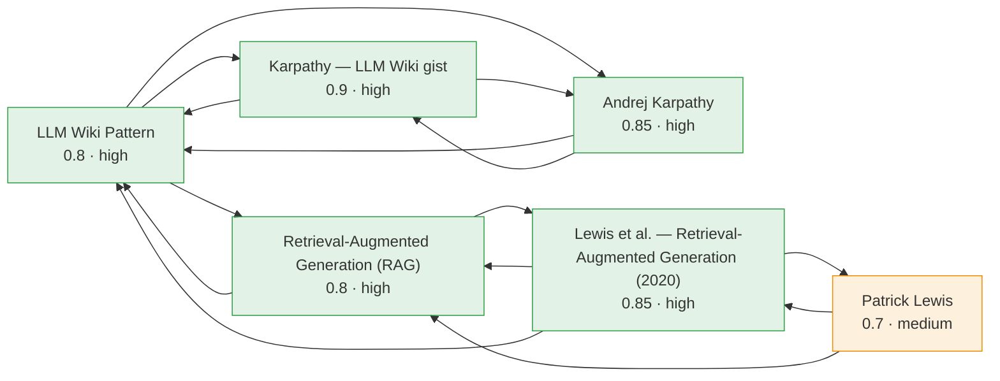

# Knowledge Graph

Nodes colored by confidence band. Regenerate with `python tools/kb.py viz`.

```mermaid
graph LR
  llm_wiki_pattern["LLM Wiki Pattern<br/>0.8 · high"]
  style llm_wiki_pattern fill:#2f9e4422,stroke:#2f9e44
  retrieval_augmented_generation["Retrieval-Augmented Generation (RAG)<br/>0.8 · high"]
  style retrieval_augmented_generation fill:#2f9e4422,stroke:#2f9e44
  andrej_karpathy["Andrej Karpathy<br/>0.85 · high"]
  style andrej_karpathy fill:#2f9e4422,stroke:#2f9e44
  patrick_lewis["Patrick Lewis<br/>0.7 · medium"]
  style patrick_lewis fill:#f08c0022,stroke:#f08c00
  karpathy_llm_wiki["Karpathy — LLM Wiki gist<br/>0.9 · high"]
  style karpathy_llm_wiki fill:#2f9e4422,stroke:#2f9e44
  rag_lewis_2020["Lewis et al. — Retrieval-Augmented Generation (2020)<br/>0.85 · high"]
  style rag_lewis_2020 fill:#2f9e4422,stroke:#2f9e44
  llm_wiki_pattern --> retrieval_augmented_generation
  llm_wiki_pattern --> karpathy_llm_wiki
  llm_wiki_pattern --> andrej_karpathy
  retrieval_augmented_generation --> rag_lewis_2020
  retrieval_augmented_generation --> llm_wiki_pattern
  andrej_karpathy --> llm_wiki_pattern
  andrej_karpathy --> karpathy_llm_wiki
  patrick_lewis --> rag_lewis_2020
  patrick_lewis --> retrieval_augmented_generation
  karpathy_llm_wiki --> andrej_karpathy
  karpathy_llm_wiki --> llm_wiki_pattern
  rag_lewis_2020 --> retrieval_augmented_generation
  rag_lewis_2020 --> patrick_lewis
  rag_lewis_2020 --> llm_wiki_pattern
```
