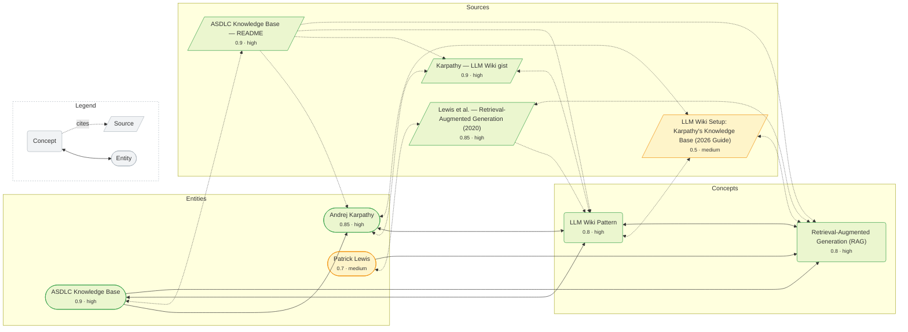

# Knowledge Graph

Every page in the wiki and how it links to the others. Read it as:

- **Shape = layer** — `(concept)` rounded, `([entity])` stadium, `[/source/]` document. Pages are grouped into their layer.
- **Colour = confidence** — green `high` (≥0.75), orange `medium` (≥0.45), red `low`. The `0.0 · band` under each title is the score.
- **Line = relationship** — solid `↔` is a concept/entity cross-link; dotted `⋯▸` is a **citation** to a source. Double-headed means both pages link back to each other.

Regenerate after any content change with `python tools/kb.py viz`.

