# Knowledge Graph

Nodes colored by confidence band. Regenerate with `python tools/kb.py viz`.

```mermaid
graph LR
  llm_wiki_pattern["LLM Wiki Pattern<br/>0.8 · high"]
  style llm_wiki_pattern fill:#2f9e4422,stroke:#2f9e44
  click llm_wiki_pattern "concepts/llm-wiki-pattern/" "Open page" _self
  retrieval_augmented_generation["Retrieval-Augmented Generation (RAG)<br/>0.8 · high"]
  style retrieval_augmented_generation fill:#2f9e4422,stroke:#2f9e44
  click retrieval_augmented_generation "concepts/retrieval-augmented-generation/" "Open page" _self
  andrej_karpathy["Andrej Karpathy<br/>0.85 · high"]
  style andrej_karpathy fill:#2f9e4422,stroke:#2f9e44
  click andrej_karpathy "entities/andrej-karpathy/" "Open page" _self
  asdlc_knowledge_base["ASDLC Knowledge Base<br/>0.9 · high"]
  style asdlc_knowledge_base fill:#2f9e4422,stroke:#2f9e44
  click asdlc_knowledge_base "entities/asdlc-knowledge-base/" "Open page" _self
  patrick_lewis["Patrick Lewis<br/>0.7 · medium"]
  style patrick_lewis fill:#f08c0022,stroke:#f08c00
  click patrick_lewis "entities/patrick-lewis/" "Open page" _self
  asdlc_knowledge_readme["ASDLC Knowledge Base — README<br/>0.9 · high"]
  style asdlc_knowledge_readme fill:#2f9e4422,stroke:#2f9e44
  click asdlc_knowledge_readme "sources/asdlc-knowledge-readme/" "Open page" _self
  karpathy_llm_wiki["Karpathy — LLM Wiki gist<br/>0.9 · high"]
  style karpathy_llm_wiki fill:#2f9e4422,stroke:#2f9e44
  click karpathy_llm_wiki "sources/karpathy-llm-wiki/" "Open page" _self
  llm_wiki_setup_guide_2026["LLM Wiki Setup: Karpathy's Knowledge Base (2026 Guide)<br/>0.5 · medium"]
  style llm_wiki_setup_guide_2026 fill:#f08c0022,stroke:#f08c00
  click llm_wiki_setup_guide_2026 "sources/llm-wiki-setup-guide-2026/" "Open page" _self
  rag_lewis_2020["Lewis et al. — Retrieval-Augmented Generation (2020)<br/>0.85 · high"]
  style rag_lewis_2020 fill:#2f9e4422,stroke:#2f9e44
  click rag_lewis_2020 "sources/rag-lewis-2020/" "Open page" _self
  llm_wiki_pattern --> retrieval_augmented_generation
  llm_wiki_pattern --> karpathy_llm_wiki
  llm_wiki_pattern --> andrej_karpathy
  llm_wiki_pattern --> asdlc_knowledge_base
  llm_wiki_pattern --> llm_wiki_setup_guide_2026
  retrieval_augmented_generation --> rag_lewis_2020
  retrieval_augmented_generation --> llm_wiki_pattern
  retrieval_augmented_generation --> llm_wiki_setup_guide_2026
  andrej_karpathy --> llm_wiki_pattern
  andrej_karpathy --> karpathy_llm_wiki
  andrej_karpathy --> llm_wiki_setup_guide_2026
  asdlc_knowledge_base --> llm_wiki_pattern
  asdlc_knowledge_base --> asdlc_knowledge_readme
  asdlc_knowledge_base --> andrej_karpathy
  asdlc_knowledge_base --> retrieval_augmented_generation
  patrick_lewis --> rag_lewis_2020
  patrick_lewis --> retrieval_augmented_generation
  asdlc_knowledge_readme --> asdlc_knowledge_base
  asdlc_knowledge_readme --> llm_wiki_pattern
  asdlc_knowledge_readme --> retrieval_augmented_generation
  asdlc_knowledge_readme --> andrej_karpathy
  asdlc_knowledge_readme --> karpathy_llm_wiki
  karpathy_llm_wiki --> andrej_karpathy
  karpathy_llm_wiki --> llm_wiki_pattern
  llm_wiki_setup_guide_2026 --> llm_wiki_pattern
  llm_wiki_setup_guide_2026 --> andrej_karpathy
  llm_wiki_setup_guide_2026 --> retrieval_augmented_generation
  rag_lewis_2020 --> retrieval_augmented_generation
  rag_lewis_2020 --> patrick_lewis
  rag_lewis_2020 --> llm_wiki_pattern
```

## Connections

| Page | Type | Confidence | 🔗 | Connects to |
| --- | --- | --- | --- | --- |
| **LLM Wiki Pattern** | concept | 0.8 high | 7 | `andrej-karpathy`, `asdlc-knowledge-base`, `asdlc-knowledge-readme`, `karpathy-llm-wiki`, `llm-wiki-setup-guide-2026`, `rag-lewis-2020`, `retrieval-augmented-generation` |
| **Retrieval-Augmented Generation (RAG)** | concept | 0.8 high | 6 | `asdlc-knowledge-base`, `asdlc-knowledge-readme`, `llm-wiki-pattern`, `llm-wiki-setup-guide-2026`, `patrick-lewis`, `rag-lewis-2020` |
| **Andrej Karpathy** | entity | 0.85 high | 5 | `asdlc-knowledge-base`, `asdlc-knowledge-readme`, `karpathy-llm-wiki`, `llm-wiki-pattern`, `llm-wiki-setup-guide-2026` |
| **ASDLC Knowledge Base — README** | source | 0.9 high | 5 | `andrej-karpathy`, `asdlc-knowledge-base`, `karpathy-llm-wiki`, `llm-wiki-pattern`, `retrieval-augmented-generation` |
| **ASDLC Knowledge Base** | entity | 0.9 high | 4 | `andrej-karpathy`, `asdlc-knowledge-readme`, `llm-wiki-pattern`, `retrieval-augmented-generation` |
| **Karpathy — LLM Wiki gist** | source | 0.9 high | 3 | `andrej-karpathy`, `asdlc-knowledge-readme`, `llm-wiki-pattern` |
| **LLM Wiki Setup: Karpathy's Knowledge Base (2026 Guide)** | source | 0.5 medium | 3 | `andrej-karpathy`, `llm-wiki-pattern`, `retrieval-augmented-generation` |
| **Lewis et al. — Retrieval-Augmented Generation (2020)** | source | 0.85 high | 3 | `llm-wiki-pattern`, `patrick-lewis`, `retrieval-augmented-generation` |
| **Patrick Lewis** | entity | 0.7 medium | 2 | `rag-lewis-2020`, `retrieval-augmented-generation` |
